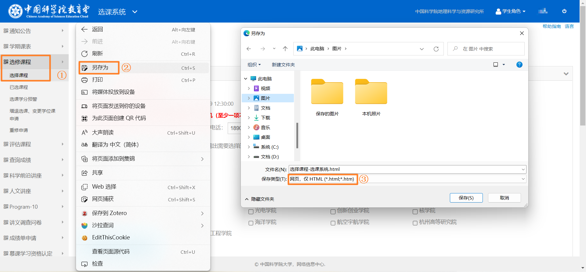
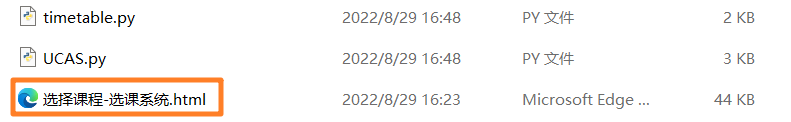

# Python UCAS课表 (.ics) 生成

根据项目[Python 大学生课表 (.ics) 生成](https://github.com/junyilou/python-ical-timetable)
针对UCAS雁西湖校区进行适配性工作。简化流程，直接根据教务系统界面导出的Html文件生成ics日程文件。

## 简介

iCalendar 是广泛使用的日历数据交换标准，在诸如 Apple 日历、Google Calendar 的日历 app 中创建日历项，不仅可清晰的了解日程安排，更可体验 iOS、Android 系统为日历提供的各种功能：计划出行时间、日程提醒、如 Siri 与 Google Assistant 等智能语音助理自动化服务等。

不过，并非所有学校都为学生提供 ics 日历，因此本代码旨在用 Python 3 协助你创建一个自己的 ics 日历课表。

**本代码的特色为：**

* 兼容 Apple 日历、Google Calendar、Outlook Calendar 等日历应用，**且支持上述应用的日历订阅**
* 支持多种课程时间安排：**单独的周数，范围的周数，奇偶周数**，如 "**第2周，5 至 11 周中的单数周，13 至 17 周**"
* 导入到系统日历后，支持诸多由操作系统提供的日历功能：例如，在 iOS 设备中添加日历项后，你可以直接向 Siri 询问：「我下周五有什么日程？」获得下周五的课表；或是在 Apple Watch 表盘上显示下一个课程的时间；或是使用 Shortcut 捷径进行更多操作

## 开始使用

### 获取选课系统Html文本

首先登录UCAS `选课系统`界面到 `已选课程`，然后右键 `另存为`，在弹出的界面中选择保存类型为 `网页，仅HTML`



### 运行程序

#### windows用户（推荐）

windows用户下载项目release打包好的exe文件，然后将上一步的html文件拷贝到exe同级目录双击运行后同目录下生成的 `UCAS.ics` 即为课程表日历订阅文件

#### 或者选择运行python源码

- 首先将上一步的html文件拷贝到代码同级目录。此时目录文件至少包括：（图片中的timetable.py文件实际为UCAS课程表小工具.py）



- 然后运行：

```
python UCAS课程表小工具.py
```

- 同目录下生成的 `UCAS.ics`即为课程表日历订阅文件

### 生成后使用

* 要了解生成日历文件后如何导入或添加日历订阅到 Apple 设备，请了解[文档](https://github.com/qwqVictor/CQUPT-ics/blob/main/docs/ImportOrSubscribe.md)。
* 要了解如何导入华为、oppo等安卓手机，请自行百度。
* 进阶使用：要了解什么是日历订阅，如何进行日历订阅，请了解[文档](https://github.com/qwqVictor/CQUPT-ics/blob/main/docs/ImportOrSubscribe.md)；
